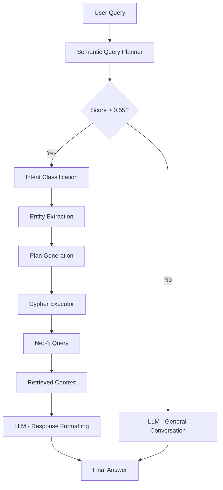

# V5 Hybrid RAG System

Hybrid forensic investigative intelligence system that combines semantic ontology, knowledge graphs, and LLMs for case analysis.

--- 

> [!IMPORTANT]
> **The quality of this system depends ENTIRELY on the quality of the ontology.**
> 
> The system extracts metadata, synonyms, important properties, and example patterns directly from the ontology (`v5core.ttl`). A poorly structured ontology with incomplete metadata or inadequate synonyms will result in inaccurate intent classification, failed entity extraction, and ineffective Cypher queries.

---

> [!IMPORTANT]
> **The V5 Hybrid does NOT remove the inherent limitations of semantic search, nor does it fully replace a large, powerful LLM.**
>
> It is still subject to ambiguities, interpretation errors, and coverage gaps — especially for open-ended, creative, or very out-of-domain questions. What the V5 Hybrid actually does is:
>
> - **Reduce costs** by relying on a smaller, ontology-guided model instead of always calling a large LLM.
> - **Increase speed** in smaller, focused environments where the ontology is well-designed.
> - **Improve structural accuracy** (intent, entity, path) when the ontology is rich in metadata, synonyms, and example patterns.
>
> In short: the V5 Hybrid is a *turbocharger* for ontology-guided structured search, not a universal replacement for general-purpose LLMs.
---


## 📋 Table of Contents

- [Architecture and Flow](#-architecture-and-flow)
- [System Components](#-system-components)
- [Prerequisites](#-prerequisites)
- [Initial Setup](#-initial-setup)
- [Available Tests](#-available-tests)
- [How to Run Tests](#-how-to-run-tests)
- [File Structure](#-file-structure)
- [Troubleshooting](#-troubleshooting)

---

## 🏗️ Architecture and Flow

The system operates in multiple phases to transform natural language queries into precise answers based on Neo4j graph data:



### Phase 1: Intent Generation (Setup)

**Script:** [`make_v5_intents.py`](make_v5_intents.py)

1. **Loading Ontology Metadata:**
   - Properties (`DatatypeProperty`): normalization type, priority, example patterns
   - Classes (`Class`): important properties, composite patterns

2. **Synonym Extraction:**
   - Fetches `synonyms_pt_clean` from each class in the ontology

3. **Graph Schema Analysis:**
   - Identifies labels, relationships, and properties
   - Builds meta-graph of relationships

4. **Automatic Intent Generation:**
   - **Simple intents (1-hop):** Direct property lookup (e.g., CPF, License Plate)
   - **Composite intents (2-3 hops):** Search through relationships (e.g., vehicle owner by plate)
   - Each intent includes:
     - Unique ID
     - Description in Portuguese
     - Query examples
     - Parameterized Cypher template
     - Entity/path information

5. **Save Configuration:**
   - Generates [`v5_intents_config.json`](v5_intents_config.json) with 300+ intents

### Phase 2: Query Processing (Runtime)

**Script:** [`semantic_query_planner.py`](semantic_query_planner.py)

1. **Initialization:**
   - Loads `v5_intents_config.json`
   - Generates embeddings for examples using `SentenceTransformer` (multilingual MiniLM model)

2. **Intent Classification:**
   - Computes embedding of user query
   - Compares with intent embeddings via cosine similarity
   - Returns top-k most similar intents

3. **Entity Extraction:**
   - Applies regex based on intent entity type
   - Normalizes values (removes punctuation, spaces)
   - Supports: CPF, Phone, License Plate (Mercosur/Old), IMEI, RENAVAM, generic text

4. **Plan Generation:**
   - Assembles execution steps with intent + extracted value
   - Validates minimum score threshold (0.4)

### Phase 3: Neo4j Execution

**Script:** [`cypher_executor.py`](cypher_executor.py)

1. **Template Loading:**
   - Maps `intent_id` → `cypher_template`

2. **Plan Execution:**
   - For each step:
     - Substitutes parameters in Cypher template
     - Executes query on Neo4j
     - Collects results as node properties

3. **Context Return:**
   - List of dicts with data retrieved from graph

### Phase 4: Response Generation

**Script:** [`rag_chat.py`](rag_chat.py)

1. **Context Formatting:**
   - Converts Neo4j results to readable text
   - Removes technical fields (`uri`, `localName`)

2. **Prompt Engineering:**
   - System: instructs LLM to use ONLY information from context
   - User: includes question + formatted context

3. **LLM Generation:**
   - Model: `Qwen/Qwen2.5-1.5B-Instruct`
   - Configuration: `do_sample=False` (greedy, more deterministic)
   - Cleans template tokens (`<|im_start|>`, `<|im_end|>`)

4. **Final Answer:**
   - Text in natural language based on graph data

---

## 🧩 System Components

| Component | File | Responsibility |
|-----------|------|----------------|
| **Ontology** | [`v5core.ttl`](v5core.ttl) | Defines semantic schema, metadata, synonyms |
| **Examples** | [`v5core-examples.ttl`](v5core-examples.ttl) | Sample data for testing |
| **Import Script** | [`reset_and_import_ontology.cypher`](reset_and_import_ontology.cypher) | Imports ontology into Neo4j via n10s |
| **Intent Generator** | [`make_v5_intents.py`](make_v5_intents.py) | Generates intents from ontology |
| **Query Planner** | [`semantic_query_planner.py`](semantic_query_planner.py) | Classifies intents and extracts entities |
| **Cypher Executor** | [`cypher_executor.py`](cypher_executor.py) | Executes queries on Neo4j |
| **RAG System** | [`rag_chat.py`](rag_chat.py) | Integrates all components + LLM |

---

## 📦 Prerequisites

### Software

- **Python 3.8+**
- **Neo4j 4.4+** running on `bolt://localhost:7687`
  - User: `neo4j`
  - Password: `neo4j123`
  - **n10s** plugin installed
  - **APOC** plugin installed
- **GPU** (recommended for LLM)

### Python Dependencies

```bash
pip install -r requirements.txt
```

Main libraries:
- `neo4j`: Neo4j driver
- `sentence-transformers`: Semantic embeddings
- `transformers`: LLMs (Qwen)
- `torch`: ML backend
- `scikit-learn`: Similarity calculations

---

## ⚙️ Initial Setup

### 1. Prepare Neo4j

Make sure Neo4j is running and plugins are installed:

```bash
# Check status
neo4j status

# Install plugins (if necessary)
# APOC and n10s should be in $NEO4J_HOME/plugins/
```

### 2. Import Ontology

Execute the Cypher script in Neo4j Browser or via `cypher-shell`:

```bash
cat reset_and_import_ontology.cypher | cypher-shell -u neo4j -p neo4j123
```

This script:
- Resets the database
- Configures n10s
- Imports `v5core.ttl`
- Imports `v5core-examples.ttl`
- Cleans label/property prefixes
- Processes synonyms

### 3. Generate Intents

```bash
python make_v5_intents.py
```

**Expected output:**
- File `v5_intents_config.json` with 300+ intents
- Log showing quantity of simple and composite intents

> [!IMPORTANT]
> This step must be re-executed whenever the ontology is modified!

---

## 🧪 Available Tests

### 1. `test_v5.py` - Intent Classification Test

**Objective:** Validate intent classification and entity extraction

**Scope:**
- 20 varied test cases
- Simple search (1-hop): CPF, phone, license plate, IMEI, RENAVAM, vehicle brand
- Composite search (multi-hop): vehicle owner, cases by CPF, evidence
- Format variations: CPF with punctuation, formatted phone, Mercosur plate
- Synonym tests: "investigado", "procedimento", "celular", "moto"

**Success Criteria:**
- ✅ Entity extracted correctly
- ✅ Correct Path/Entity Type
- ✅ Score > 0.5

**Execution:**
```bash
python test_v5.py
```

**Expected output:**
```
🧪 V5 Hybrid Planner Tests with Synonyms

============================================================
Test 1: Simple CPF search
Query: 'Search for person with CPF 12345678900'
  Intent: intent_1 (score: 0.875)
  Description: Search Person by CPF
  ✅ PASSED
     Entity: 12345678900
```

### 2. `test_rag_real.py` - Complete RAG Flow Test

**Objective:** Validate end-to-end integration with Neo4j and LLM

**Scope:**
- Real test using data from `v5core-examples.ttl`
- Query: "Who is the owner of vehicle with plate ABC1D23?"
- Validates:
  - Intent classification
  - Neo4j search (should return João da Silva)
  - LLM response generation
  - Response quality (mentions name and plate)

**Execution:**
```bash
python -m unittest test_rag_real.py
```

**Expected output:**
```
🚀 Initializing REAL RAG Test (may take a while to load LLM)...
❓ Question: Who is the owner of vehicle with plate ABC1D23?
   Intent: intent_123 (Score: 0.834)
   Neo4j Results: 1 records found
   Generating LLM response (please wait)...
   LLM Response (2.3s): The owner of vehicle with plate ABC1D23 is João da Silva.
   ✅ Test PASSED - Valid and complete response!
```

### 3. `test_rag_flow.py` - Flow Test (Mock)

**Objective:** Validate flow logic without external dependencies

> [!NOTE]
> This test may use Neo4j/LLM mocks to validate only integration logic.

---

## 🚀 How to Run Tests

### Complete Setup (First Run)

```bash
# 1. Import ontology
cat reset_and_import_ontology.cypher | cypher-shell -u neo4j -p neo4j123

# 2. Generate intents
python make_v5_intents.py

# 3. Run classification tests (fast, no LLM)
python test_v5.py

# 4. Run complete RAG test (slow, loads LLM)
python -m unittest test_rag_real.py
```

### Quick Tests (Development)

```bash
# Only intent classification (2-5 seconds)
python test_v5.py
```

### Complete Test (Validation)

```bash
# Complete flow with LLM (2-5 minutes first time, ~30s after)
python -m unittest test_rag_real.py -v
```

### Interactive Chat (Demo)

```bash
# Start interactive chat
python rag_chat.py
```

**Usage example:**
```
💬 Chat started. Type 'exit' to quit.
--------------------------------------------------

👤 You: who was arrested for drug trafficking?
   Thinking...
   intent_45: 0.782
   ✅ Found 1 records.
🤖 v5: Carlos Santos (CPF 98765432100) was arrested in flagrante for drug trafficking.

👤 You: what drugs was he carrying?
   ...
```

---

## 📁 File Structure

```
v5-hybrid-repo/
├── README.md                          # This file
├── requirements.txt                   # Python dependencies
│
├── v5core.ttl                     # Main ontology (WITH METADATA)
├── v5core-examples.ttl            # Sample data
├── reset_and_import_ontology.cypher   # Import script
│
├── make_v5_intents.py                 # Intent generator (metadata-driven)
├── v5_intents_config.json             # Generated intents (300+)
│
├── semantic_query_planner.py          # Intent classifier
├── cypher_executor.py                 # Query executor
├── rag_chat.py                        # Complete RAG system
│
├── test_v5.py                         # Classification tests
├── test_rag_real.py                   # Complete RAG tests
└── test_rag_flow.py                   # Flow tests
```

---

## 🔧 Troubleshooting

### Problem: `v5_intents_config.json` doesn't exist

**Solution:**
```bash
python make_v5_intents.py
```

### Problem: No intents found

**Cause:** Ontology not imported or metadata missing

**Solution:**
1. Check Neo4j: `MATCH (n) RETURN count(n)`
2. Reimport ontology: `cat reset_and_import_ontology.cypher | cypher-shell ...`
3. Check metadata: `MATCH (p:DatatypeProperty) WHERE p.normalizationType IS NOT NULL RETURN p`

### Problem: Scores always low

**Cause:** Inadequate synonyms or examples in ontology

**Solution:**
1. Check synonyms: `MATCH (n:Resource) WHERE n.synonyms_pt_clean IS NOT NULL RETURN n.localName, n.synonyms_pt_clean`
2. Add more examples in `v5core.ttl`:
   ```turtle
   v5:cpf a owl:DatatypeProperty ;
       v5:examplePattern "CPF 11122233344|Search person with CPF <VALUE>" .
   ```
3. Regenerate intents: `python make_v5_intents.py`

### Problem: LLM returns template tokens

**Cause:** Incompatible model or tokenizer version

**Solution:**
1. Check version: `transformers==4.35.0` or higher
2. Adjust token cleaning in [`rag_chat.py:L90-L96`](rag_chat.py#L90-L96)

### Problem: Neo4j connection error

**Solution:**
1. Check if Neo4j is running: `neo4j status`
2. Check credentials in [`cypher_executor.py:L14-L16`](cypher_executor.py#L14-L16)
3. Test manual connection:
   ```bash
   cypher-shell -u neo4j -p neo4j123
   ```

### Problem: CUDA/GPU not available

**Solution:**
System works with CPU (slower). To force CPU:
```python
# In rag_chat.py, line 40
device_map="cpu",  # Instead of "auto"
```

---

## 📊 Quality Metrics

The system is only as good as the ontology. Evaluate quality by checking:

- ✅ **Synonym Coverage:** Do all classes have `synonyms_pt_clean`?
- ✅ **Property Metadata:** Do all `DatatypeProperty` have `normalizationType` and `propertyPriority`?
- ✅ **Composite Examples:** Do important classes have `compositeExamplePattern`?
- ✅ **Important Properties:** Do classes have `hasImportantProperty` to guide multi-hop intents?

**Quality Checklist:**
```cypher
// Missing synonyms
MATCH (c:Class)
WHERE c.synonyms_pt_clean IS NULL
RETURN c.localName

// Missing property metadata
MATCH (p:DatatypeProperty)
WHERE p.normalizationType IS NULL
RETURN p.localName

// Classes without important properties
MATCH (c:Class)
WHERE c.hasImportantProperty IS NULL
RETURN c.localName
```

---

## 🎯 Example Supported Queries

```
✅ Search for person with CPF 12345678900
✅ Find phone (11) 99988-7766
✅ Who is the owner of vehicle with plate ABC1D23?
✅ Search for case of suspect with CPF 98765432100
✅ Which cases are associated with vehicle XYZ9876?
✅ Search WhatsApp messages from phone 21987654321
✅ Find cell phone 11912345678
✅ Search for Honda motorcycle
```

---

## 📝 Development Notes

- System uses **multilingual embeddings** (PT/EN) for robustness
- **Score threshold:** 0.55 for graph queries, 0.4 for validation
- **Normalization:** Automatic based on metadata (`numeric`, `alphanumeric`, `text`)
- **LLM:** Configured with `do_sample=False` for deterministic responses
- **Performance:** First query loads LLM (~30s), subsequent queries are fast (~2s)

---

**Version:** 5.2-metadata  
**Last Updated:** 2025-11-29